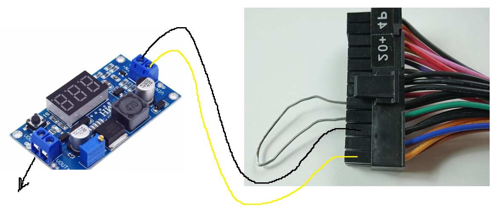

# Fonte assimétrica caseira

Use uma fonte velha de PC e use um regulador de tensão dc-dc barato que é regulado por um trimpot:

Soprador de Calor caseiro Sem estação

https://www.youtube.com/watch?v=O4DpxJzDpsA

# Lampada série para indeficação de curto e proteção de placas

https://www.youtube.com/watch?v=TJINTGXMxDo
