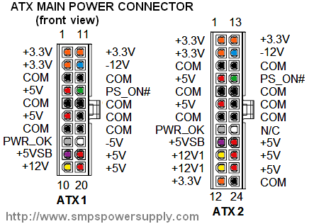
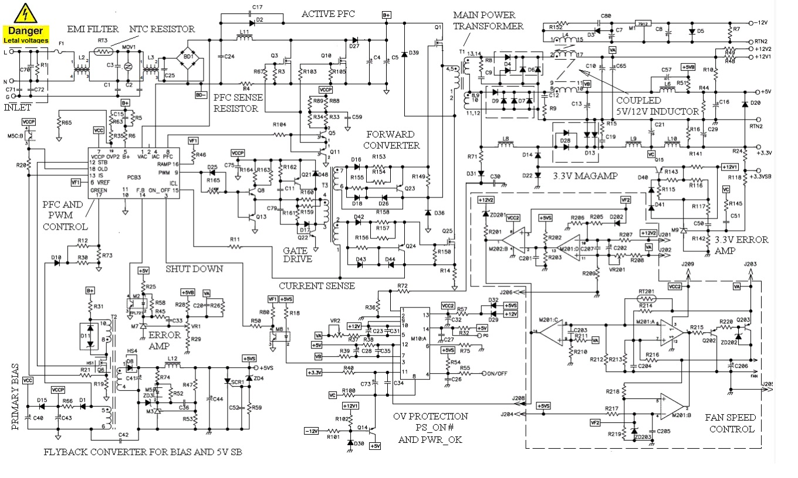

# Fonte ATX

## Problemas

1 - Fonte dando choque:
- Cabo da energia oxidado ou em curto
- Discipador interno da fonte ou alguma coisa interna incostando na carcaça da fonte
- O aterramentao interno da fonte ligado diretamente do chassi

## Básico

unidade de fonte de alimentação (power supply unit (PSU)). converta a voltagem de entrada em uma voltagem ou voltagens adequadas para seus circuitos.

O tipo mais comum de PSU hoje é a fonte de alimentação em modo comutado (SMPS). Existem diversas topologias de SMPS e suas implementações práticas usadas pelos fabricantes de PSU. No entanto, todos utilizam os mesmos conceitos básicos.

Este é um diagrama de circuito conceitual. Este esquema não mostra o circuito de controle, por isso você vê todos os gates dos MOSFETs e bases dos transistores abertos. Para maior clareza, as partes responsáveis por funções auxiliares diversas, como limite de corrente, controle de ventilador e proteção contra sobretensão (OV), que não são essenciais para o aprendizado dos conceitos básicos da conversão de energia, também não são mostradas

- O receptáculo de entrada AC em um PC é do tipo IEC 320 ou equivalente
- O fusível "F" é seguido por um filtro EMI (O filtro normalmente consiste em uma combinação de indutores de modo diferencial e modo comum e capacitores. Seu principal objetivo é reduzir o ruído de rádio frequência conduzido emitido pela fonte de alimentação de volta para a linha de entrada para cumprir os requisitos regulamentares. Reduzir o ruído conduzido também reduz as emissões radiadas das linhas de alimentação de entrada que atuam como uma antena. A seção de entrada geralmente também inclui componentes de limitação de corrente de surto e proteção contra surtos.)
- O filtro EMI na maioria das fontes de alimentação SMPS offline é seguido por uma ponte retificadora (RB) e um estágio de correção do fator de potência (PFC).(Este estágio estava ausente nas SMPS mais antigas, nas quais o retificador era seguido por um grande capacitor de armazenamento.)
- (PFC) Os fabricantes de fontes de alimentação começaram a introduzir a técnica PFC no final dos anos 80, quando os europeus introduziram a norma EN61000-3-2. Este documento especifica a amplitude máxima dos harmônicos de frequência da linha para várias categorias de equipamentos. Nosso diagrama mostra um estágio PFC típico que consiste em um retificador de onda completa e um conversor boost com um capacitor de armazenamento C1. Note que, neste esquema, a corrente sempre flui através de dois diodos da ponte retificadora. Existem também os chamados “PFC sem ponte” que eliminam um diodo do caminho da corrente.
-  O capacitor de armazenamento (o maior) é projetado para fornecer energia à saída durante interrupções curtas de energia de entrada. Na prática, pode haver vários capacitores de armazenamento em paralelo.
-  As fontes de alimentação de computadores, bem como as unidades comerciais, normalmente precisam suportar pelo menos um ciclo da onda senoidal de entrada, que é de 16 ms nos EUA e 20 ms na Europa. O boost PFC fornece uma tensão de link DC (Vdc) que é superior ao pico do AC de entrada. Nas fontes de alimentação de computadores modernas, essa tensão é tipicamente de 375-400 VDC. Se você estiver tentando solucionar problemas em uma unidade e medir cerca de 160 VDC em C1, isso significa que o estágio boost não está funcionando.
-  O estágio DC-DC de saída em qualquer SMPS sempre contém um ou mais dispositivos de comutação que periodicamente comutam redes LC.
- O diagrama acima mostra um conversor direto (forward converter) com reset ativo. O half-bridge (meia ponte) também é frequentemente usado nos projetos de PCs.

- O interruptor principal Q2 aplica periodicamente a tensão Vdc ao primário do transformador de potência T1. Quando Q2 está no estado "ligado", a tensão positiva aparece nos terminais superiores dos secundários de T2.
- Como resultado, os diodos retificadores D2, D4, D7 e D9 conduzem, e a energia da fonte de entrada é entregue às cargas. Ao mesmo tempo, alguma energia também é acumulada nos núcleos de T2 e nos indutores L2, L4, L5 e L6.
- Quando Q2 está no estado "desligado", as tensões nos secundários de T2 invertem as polaridades e os diodos retificadores ficam polarizados reversamente. Como os indutores de saída ainda tentam manter o fluxo de corrente, a polaridade das tensões através deles se inverte de acordo com a lei de Faraday.
- Como resultado, os indutores continuam conduzindo através dos diodos de despreocupados D3, D5, D8 e D10, mantendo assim circuitos de corrente fechados através de suas respectivas cargas.
- Durante este intervalo de tempo, o interruptor auxiliar Q3 fornece a fixação e o reset ativo do transformador principal. Quando Q3 desliga, Q2 liga em zero volts, o que reduz suas perdas de comutação.

- O circuito de controle regula a saída de 5V usando modulação por largura de pulso (PWM).
-  O barramento de 3,3V é derivado do mesmo enrolamento secundário que o de 5V. Você pode ver que há um indutor adicional, L3, no caminho da corrente de 3,3V. Este é um indutor magamp. Ele é usado para bloquear uma parte do pulso, a fim de reduzir a tensão regulada para 3,3V.Um transistor auxiliar, Q4, define a corrente de reset do indutor magamp L3. Esta corrente determina os volts-segundos bloqueados por L3. O amplificador de erro de +3,3V (não mostrado no diagrama) frequentemente usa sensoriamento remoto para compensar a queda excessiva de tensão no cabo.
- As saídas #3 e #4 (+/-12V) na fonte de alimentação descrita são semi-reguladas. Elas não são reguladas por um controle de loop fechado individual, mas são parcialmente estabilizadas pelo PWM agindo no barramento principal de 5V.

- Todas as saídas DC são então levadas a conectores padronizados do chicote. Aqui está o pinout do conector principal ATX.
- Observe que os sistemas ATX modernos têm pelo menos dois trilhos de 12V: +12V1 e +12V2. No entanto, na maioria dos casos, ambos vêm da mesma saída física de 12V

- Um conversor flyback separado consiste no MOSFET de potência Q5, no transformador T2, no retificador D11 e no capacitor de filtro C7. Ele serve a dois propósitos: fornecer polarização ao circuito de controle e fornecer uma tensão de standby de 5V (5VSB). Essa tensão deve estar presente sempre que a energia AC for aplicada à fonte. Ela alimenta os circuitos que permanecem operacionais quando os trilhos de saída DC principais estão desativados. Veja um exemplo de design de um flyback simples de 12V.

## Fonte real

O diagrama abaixo mostra um esquema parcial de uma fonte de alimentação ATX de 450 watts. Sua construção é típica de uma PSU moderna de computador, com interruptores MOSFET e correção ativa do fator de potência (PFC). Note que a maioria dos esquemas circulando na internet retratam PSUs de estilo antigo, com transistores bipolares e sem PFC.

- A energia AC é aplicada através de uma entrada IEC. A corrente de entrada então flui por um filtro EMI, que reduz o nível de harmônicos de alta frequência na corrente retirada da rede elétrica.

- O resistor RT3 limita a corrente de surto inicial nos capacitores descarregados C4 e C5. Ele tem um coeficiente de temperatura negativo. À medida que aquece, sua resistência diminui, o que reduz as perdas de condução no modo de estado estacionário.

- A ponte retificadora BD1 converte a AC bipolar em uma tensão pulsante unipolar.

- O pré-regulador boost fornece correção ativa do fator de potência (PFC) e o link DC B+ para o conversor de saída. Seu trem de força consiste nas seguintes partes: MOSFETs paralelos Q3 e Q10, indutor L11, diodo D27 e capacitores de armazenamento C4 e C5.

- O conversor de saída está configurado como um conversor direto de dois interruptores. Sua seção primária contém os interruptores MOSFET rápidos Q1, Q25, e os diodos de reset D36, D39. Quando Q1 e Q25 são ligados, a tensão do link DC B+ é aplicada ao primário do transformador T1. Isso cria tensões positivas nos lados pontilhados de todos os secundários, o que, por sua vez, polariza diretamente os retificadores de saída D4, D9 e, após um tempo, também D28.

- Ambos os MOSFETs são acionados através do transformador de acionamento de gate T3, com diversos componentes de modelagem de pulso. Na minha opinião, para esse nível de potência, uma implementação tão complexa de acionamento de gate é absolutamente desnecessária. Poderiam simplesmente colocar um CI de driver duplo com saídas complementares no lado primário de T3 e resistores de 10-30 Ohm nos secundários. A corrente primária é detectada através do resistor R14. Esse sinal é usado para controle em modo de corrente e limitação de potência. O indutor L4 possui três bobinas para as saídas de +5V, +12V e -12V. A bobina 1-15 opera em modo flyback – conduz quando Q1 e Q25 estão desligados.

- A tensão negativa de 12V é regulada por um regulador linear de 3 terminais, M1. Esta fonte de alimentação usa uma regulação combinada de +5V e +12V. O amplificador de erro é implementado com M7, que é um regulador shunt de 3 terminais, como o TL431. Ele detecta as tensões desses trilhos e responde à sua combinação variando a corrente do optoacoplador M2, que, por sua vez, afeta o ciclo de trabalho do PWM. Note que, como há apenas um ponto de feedback, nenhuma das saídas é rigidamente estabilizada.

- O trilho de +3,3V é ajustado por um chamado amplificador magnético (magamp) composto pelo indutor saturável L8, o transistor bipolar Q15, o diodo D14 e o circuito de controle. A indutância inicial de L8 é muito maior do que a de L9, então, no início de cada ciclo de comutação, L8 impede a corrente de fluir através de D28. Em seguida, L8 satura rapidamente e D28 começa a conduzir. O tempo de bloqueio depende da corrente de reset através de Q15 e D14, que, por sua vez, é definida pelo regulador shunt M9.

- O pré-regulador PFC e o conversor principal são controlados por uma placa auxiliar PCB3, cujos detalhes não são mostrados aqui.

- Funções de status e proteção diversas são implementadas com o CI M10. O diagrama não fornece seu número de peça. Pode ser um CI monitor especializado projetado especificamente para fontes de alimentação de computador. Um conversor flyback auxiliar com o interruptor de potência Q6 e o transformador de isolamento T2 fornece standby de 5V e polarização para o circuito de controle. Ele usa o amplificador de erro M3 e o optoacoplador de feedback M5 para regular o +5VS. Finalmente, o circuito ao redor do comparador quad M201 fornece controle de velocidade do ventilador usando o termistor RT201.

Fontes OK:

- https://www.youtube.com/watch?v=YqngrLVQ71E - ok
- https://www.youtube.com/watch?v=Zbu7Ewd5o3Q - ok
- https://www.youtube.com/watch?v=whWq20NKPG4 - ok
- https://www.youtube.com/watch?v=n5nGP30MdDk - ok
  
- https://www.youtube.com/watch?v=0joFxJbNIHY
- https://www.smpspowersupply.com/atx-power-supply.html -ok
- https://www.youtube.com/watch?v=9dXF-0jhCMw
- https://www.powerfactor.us/circuit.html
