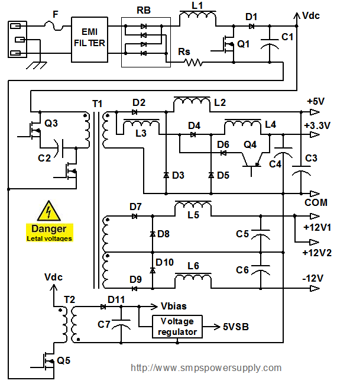
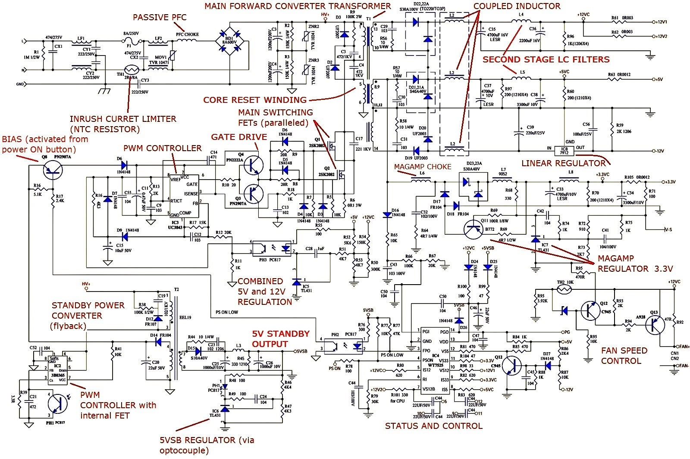

# Fonte ATX

## Problemas

1 - Fonte dando choque:
- Cabo da energia oxidado ou em curto
- Discipador interno da fonte ou alguma coisa interna incostando na carcaça da fonte
- O aterramentao interno da fonte ligado diretamente do chassi

## Básico

unidade de fonte de alimentação (power supply unit (PSU)). converta a voltagem de entrada em uma voltagem ou voltagens adequadas para seus circuitos.

O tipo mais comum de PSU hoje é a fonte de alimentação em modo comutado (SMPS). Existem diversas topologias de SMPS e suas implementações práticas usadas pelos fabricantes de PSU. No entanto, todos utilizam os mesmos conceitos básicos.

Este é um diagrama de circuito conceitual. Este esquema não mostra o circuito de controle, por isso você vê todos os gates dos MOSFETs e bases dos transistores abertos. Para maior clareza, as partes responsáveis por funções auxiliares diversas, como limite de corrente, controle de ventilador e proteção contra sobretensão (OV), que não são essenciais para o aprendizado dos conceitos básicos da conversão de energia, também não são mostradas

- O receptáculo de entrada AC em um PC é do tipo IEC 320 ou equivalente
- O fusível "F" é seguido por um filtro EMI (O filtro normalmente consiste em uma combinação de indutores de modo diferencial e modo comum e capacitores. Seu principal objetivo é reduzir o ruído de rádio frequência conduzido emitido pela fonte de alimentação de volta para a linha de entrada para cumprir os requisitos regulamentares. Reduzir o ruído conduzido também reduz as emissões radiadas das linhas de alimentação de entrada que atuam como uma antena. A seção de entrada geralmente também inclui componentes de limitação de corrente de surto e proteção contra surtos.)
- O filtro EMI na maioria das fontes de alimentação SMPS offline é seguido por uma ponte retificadora (RB) e um estágio de correção do fator de potência (PFC).(Este estágio estava ausente nas SMPS mais antigas, nas quais o retificador era seguido por um grande capacitor de armazenamento.)
- (PFC) Os fabricantes de fontes de alimentação começaram a introduzir a técnica PFC no final dos anos 80, quando os europeus introduziram a norma EN61000-3-2. Este documento especifica a amplitude máxima dos harmônicos de frequência da linha para várias categorias de equipamentos. Nosso diagrama mostra um estágio PFC típico que consiste em um retificador de onda completa e um conversor boost com um capacitor de armazenamento C1. Note que, neste esquema, a corrente sempre flui através de dois diodos da ponte retificadora. Existem também os chamados “PFC sem ponte” que eliminam um diodo do caminho da corrente.
-  O capacitor de armazenamento (o maior) é projetado para fornecer energia à saída durante interrupções curtas de energia de entrada. Na prática, pode haver vários capacitores de armazenamento em paralelo.
-  As fontes de alimentação de computadores, bem como as unidades comerciais, normalmente precisam suportar pelo menos um ciclo da onda senoidal de entrada, que é de 16 ms nos EUA e 20 ms na Europa. O boost PFC fornece uma tensão de link DC (Vdc) que é superior ao pico do AC de entrada. Nas fontes de alimentação de computadores modernas, essa tensão é tipicamente de 375-400 VDC. Se você estiver tentando solucionar problemas em uma unidade e medir cerca de 160 VDC em C1, isso significa que o estágio boost não está funcionando.
-  O estágio DC-DC de saída em qualquer SMPS sempre contém um ou mais dispositivos de comutação que periodicamente comutam redes LC.

Fontes OK:

- https://www.youtube.com/watch?v=YqngrLVQ71E - ok
- https://www.youtube.com/watch?v=Zbu7Ewd5o3Q - ok
- https://www.youtube.com/watch?v=whWq20NKPG4 - ok

- https://www.youtube.com/watch?v=n5nGP30MdDk
- https://www.youtube.com/watch?v=0joFxJbNIHY
- https://www.smpspowersupply.com/atx-power-supply.html
