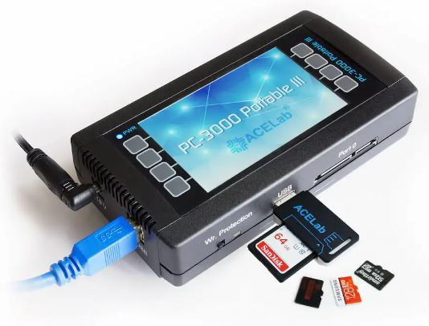

### Softwares 2022 
- R-Studio (https://www.r-studio.com/pt/data-recovery-software/)
- FTK - Forensic Toolkit (não sei o link ao certo)

### Ferramentas
- ACELAB PC3000 

### Reconhecimento de Aparelho
- Os SSD podem ter capacidades diferentes e marcas diferentes mas se tiverem o mesmo controlador são compatíveis

## SSD

CORROMPIDO

- Conectar no PC. E não faz barulho: {

}

- Conectar no PC. Se fizer o barulho de reconhecimento: {
    (- Software (R-STudio): Ele reconhece mas com uma nomeclatura genérica e sem a  informação da capacidade do SSD (isso aponta que tem um problema)
    - Software (FTK):  Ele reconhece mas com uma nomeclatura genérica e com 0bits de capacidade (isso aponta que tem um problema)):{
        - Agora você vai abrir o SSD e verificar se ele tem algum problema físico:{
            - Geralmente os SSD em um ponto de modo de segurança (SafeMode). Em muitos casos são acionados fazendo um JUMP específico na placa.
            
            
            Se o ssd estiver funcionado o PC vai reconhece-lo com outro nome em com uma capacidade baixa (16k) - por está no modo de segurança
        }
    }
    
    (- Software (R-STudio): Ele reconhece mas com uma nomeclatura genérica mas com uma capacidade totaltamente errada (isso aponta que tem um problema)):{
        - Pode usar o PC3000 para extrair os dados do ssd manipulando a sua memória ram:{
            - Com o SSD em modo de segurança (jump): 
                - Executar o processo chamado Tradutor
                - Abrir o data stractor
                OBS: dependendo do caso o processo pode ser muito lento (demorar mais de 5 dias)
        }
    }
    
    
    (- Software (R-STudio): Ele reconhece mas com uma nomeclatura genérica mas com a capacidade correta (isso aponta que tem um problema)):{
        - Pode usar o PC3000 para extrair os dados do ssd manipulando a sua memória ram:{
            - Com o SSD em modo de segurança (jump): 
                - Executar o processo chamado Tradutor
                - Abrir o data stractor
                OBS: dependendo do caso o processo pode ser muito lento (demorar mais de 5 dias)
        }
    }
    
}

- Conecta no PC. Defeito intermintente (hora responde, hora não responde):{
    	- Criar uma cópia bit a bit para outro hd
}

