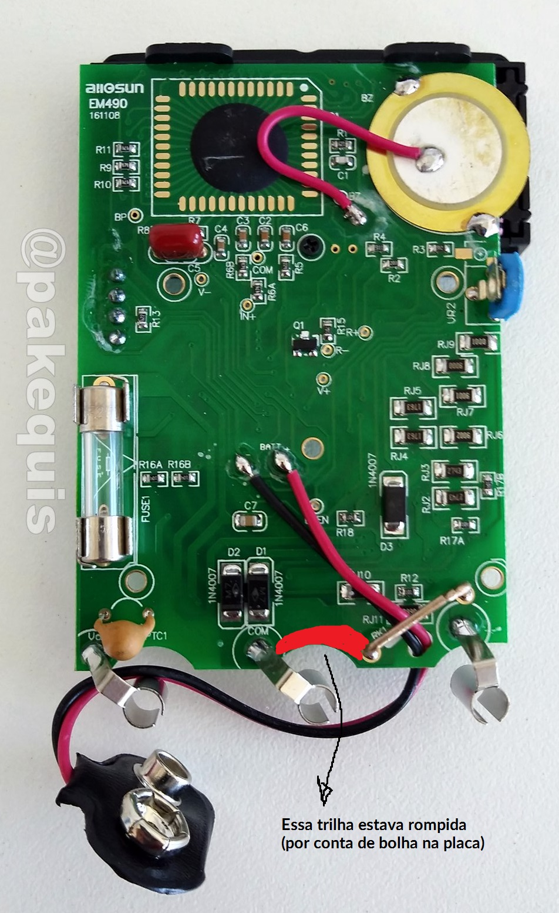

## Problema: O multimetro não funcionava a escala de Resistencia e Diodo.

(Não dá pra te certesa) Aparentimente ele caiu na agua e tentaram em 10A voltagem de uma bateria automotiva. Mas a placa está apresentando algumas bolhas.

Trilha rompida:

