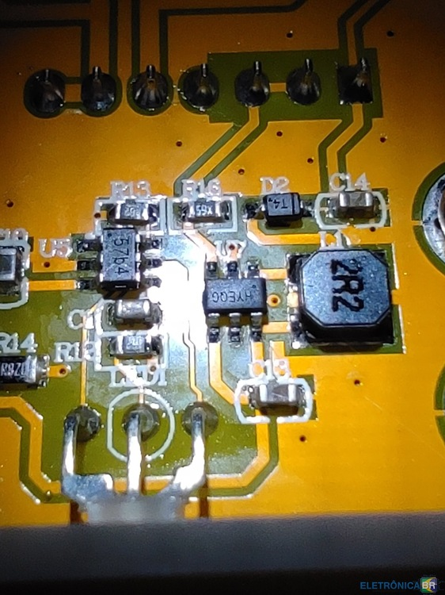
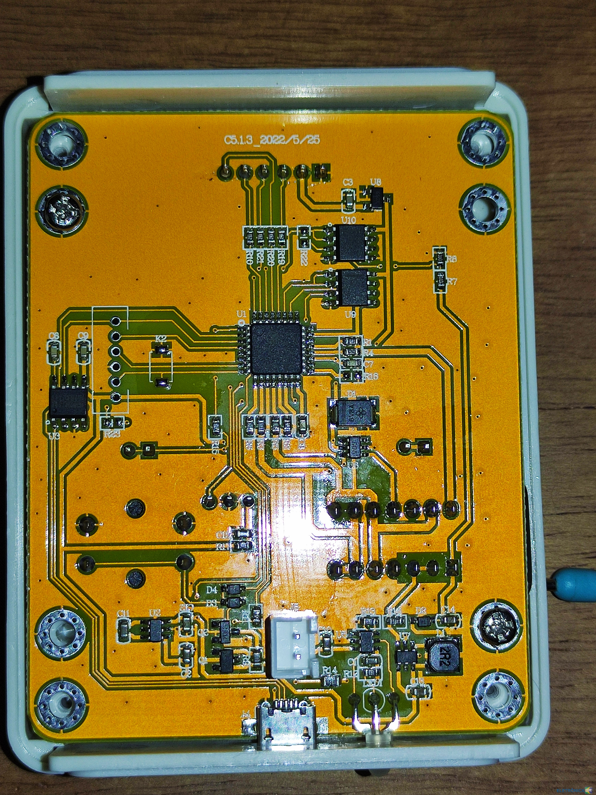

Defeito 1:

Após alguns testes o aparelho deu defeito. Agora ele só mostra o resultado "Diodo Zener", mesmo sem componente.

O meu LCR TC1 utiliza a mesma placa c5.1.3 que o seu. A área defeituosa do seu medidor é um step-up, responsável por gerar 31 volts para testar diodos zener. Talvez o capacitor c14 tenha entrado em curto e por isso queimou o diodo. Talvez volte a funcionar se substituir o diodo D2 e o capacitor c14. O capacitor c14 é um T4, ou seja, é um 1N4148WS. O capacitor c14 é um capacitor SMD comum de cerâmica, deve ser de alguns picofarad, mas o importante é escolher um capacitor que suporte tensão maior que 31 volts, se não ele vai entrar em curto novamente.

O circuito integrado step-up é um HYEQG, não encontrei o datasheet dele.

Infelizmente ainda não há um datasheet da placa inteira para a nossa versão. O principio de funcionamento é o mesmo, apenas alguns componentes foram alterados.

Defeito 2:

quando aperto o botão, ele liga , mas permanece a tela congelada em testing.....  até acabar a bateria . Ja identifiquei o problema , é um ci smd SRV05-4  (U-6) que faz a segurança do processador contra descargas ESD , talvez queimado porque eu tenha ligado um capacitor sem antes descarrega-lo , mas de qualquer forma vou comprar e testar e depois posto o resultado aqui no site.

Estou te informando porque nesta minha procura encontrei um site em Russo que aponta o ci HYEQG como sendo um SY7200A , inclusive se você procurar para compra-lo no aliexpress ele fornece a indicação HY..... , porque o resto é data de fabricação e algumas variações de temperatura de trabalho . Estou postando o endereço original do site , caso você queira dar uma olhada para ver se ha mais alguma informação que lhe sirva . Espero que isso lhe ajude !
