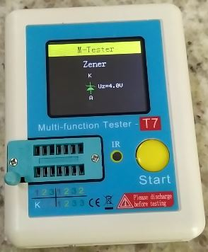
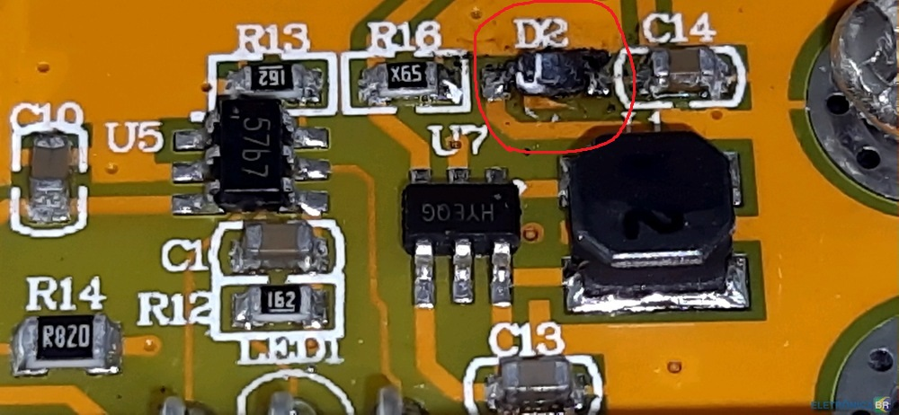

Defeito 1:

Após alguns testes o aparelho deu defeito. Agora ele só mostra o resultado "Diodo Zener", mesmo sem componente.

O meu LCR TC1 utiliza a mesma placa c5.1.3 que o seu. A área defeituosa do seu medidor é um step-up, responsável por gerar 31 volts para testar diodos zener. Talvez o capacitor c14 tenha entrado em curto e por isso queimou o diodo. Talvez volte a funcionar se substituir o diodo D2 e o capacitor c14. O capacitor c14 é um T4, ou seja, é um 1N4148WS. O capacitor c14 é um capacitor SMD comum de cerâmica, deve ser de alguns picofarad, mas o importante é escolher um capacitor que suporte tensão maior que 31 volts, se não ele vai entrar em curto novamente.

O circuito integrado step-up é um HYEQG, não encontrei o datasheet dele.

Infelizmente ainda não há um datasheet da placa inteira para a nossa versão. O principio de funcionamento é o mesmo, apenas alguns componentes foram alterados.

