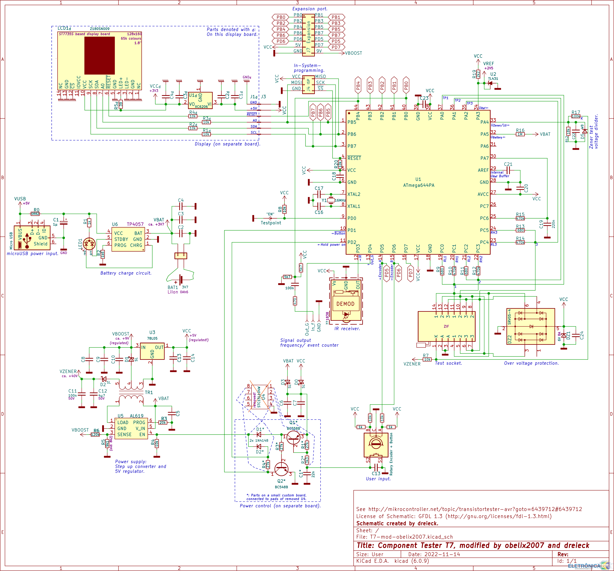
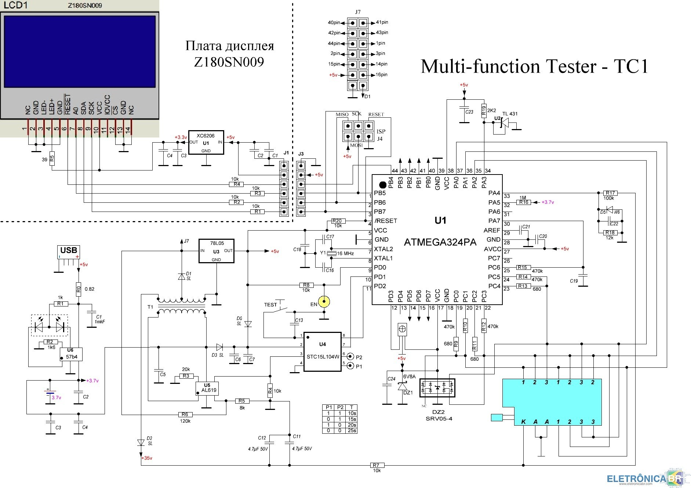

Defeito 1:

Após alguns testes o aparelho deu defeito. Agora ele só mostra o resultado "Diodo Zener", mesmo sem componente.

O meu LCR TC1 utiliza a mesma placa c5.1.3 que o seu. A área defeituosa do seu medidor é um step-up, responsável por gerar 31 volts para testar diodos zener. Talvez o capacitor c14 tenha entrado em curto e por isso queimou o diodo. Talvez volte a funcionar se substituir o diodo D2 e o capacitor c14. O capacitor c14 é um T4, ou seja, é um 1N4148WS. O capacitor c14 é um capacitor SMD comum de cerâmica, deve ser de alguns picofarad, mas o importante é escolher um capacitor que suporte tensão maior que 31 volts, se não ele vai entrar em curto novamente.

O circuito integrado step-up é um HYEQG, não encontrei o datasheet dele.

Infelizmente ainda não há um datasheet da placa inteira para a nossa versão. O principio de funcionamento é o mesmo, apenas alguns componentes foram alterados.

U7 - este é SY7200A (marcando HY6VE)

Essa falha ocorrerá mais cedo ou mais tarde em todas as unidades LCR-TXx com esse design de placa de PC, onde o trilho da fonte de alimentação de 30 V se conecta diretamente ao terminal K do soquete de teste.

Ao contrário do circuito de teste Zener do testador de transistor OSHW original, que tem um IC "regulador de tensão de comutação de aumento" gerando um trilho estável de 30 V seguido por um resistor em série de 10 K, este fabricante substituiu um IC "driver de LED de corrente constante de aumento". O principal erro deles é que eles falharam em colocar um resistor em série adequado > 2K2 ohms entre o trilho de 30 V e o pino K.

Aqui está o que aconteceu: quando um zener ou um diodo (polarizado para frente) é conectado entre KA enquanto o testador está em um estado energizado, isso danifica o pino de entrada de detecção de corrente do IC de elevação (U7 na placa de PC). Na verdade, qualquer componente eletrônico com baixa resistência <1K ohms ou um capacitor com ESR baixo pode causar essa falha. Este pino no IC de elevação (U7) tem uma tensão de entrada máxima de 4V. Este pino IC é conectado ao terminal A do soquete de teste. O pior caso é colocar um curto direto entre K e A enquanto o testador LCR está energizado com a tela LCD ligada. Há um capacitor de filtro (C14) no trilho de 30V (K no soquete de teste). C14 carrega uma carga de 30V. Fazer um curto-circuito de KA despeja toda a energia armazenada dentro de C14 diretamente no pino de detecção de corrente do IC de elevação. Embora a duração possa ser breve, 30V é muito mais do que 4V. Em muitos casos, apenas a porção de detecção de corrente do U7 é destruída. O resto do U7 continua a operar, gerando 30 V sem nenhuma limitação de corrente. Isso permite a corrente de pico de até 500 mA através do KA. É por isso que um zener em teste pode ficar extremamente quente quase instantaneamente.

Usei um resistor de série 2K2 na minha unidade. Se a resistência da série for maior, o testador pode relatar que um zener está sendo testado enquanto os pinos KA estão em circuito aberto. Um valor de 2K2 é suficiente para proteger U7 de danos.

Para concluir, a solução é:
1) Corte a folha da placa de circuito impresso que leva ao pino K e, em seguida, conecte o resistor 2K2 da junção de D2 e ​​C14 ao pino K,
2) Substitua U7 se estiver com defeito ou queimado
3) Substitua D2 se estiver com defeito ou queimado
4) Verifique se a tensão de circuito aberto de K para A é de aproximadamente 30 V
5) Coloque um resistor de 1 K em KA e confirme se o testador identifica isso como um zener de 5 a 7 V.

Correção no projeo para evitar queimar:

Defeito 2:

quando aperto o botão, ele liga , mas permanece a tela congelada em testing.....  até acabar a bateria . Ja identifiquei o problema , é um ci smd SRV05-4  (U-6) que faz a segurança do processador contra descargas ESD , talvez queimado porque eu tenha ligado um capacitor sem antes descarrega-lo , mas de qualquer forma vou comprar e testar e depois posto o resultado aqui no site.

Estou te informando porque nesta minha procura encontrei um site em Russo que aponta o ci HYEQG como sendo um SY7200A , inclusive se você procurar para compra-lo no aliexpress ele fornece a indicação HY..... , porque o resto é data de fabricação e algumas variações de temperatura de trabalho . Estou postando o endereço original do site , caso você queira dar uma olhada para ver se ha mais alguma informação que lhe sirva . Espero que isso lhe ajude !

## Esquema

