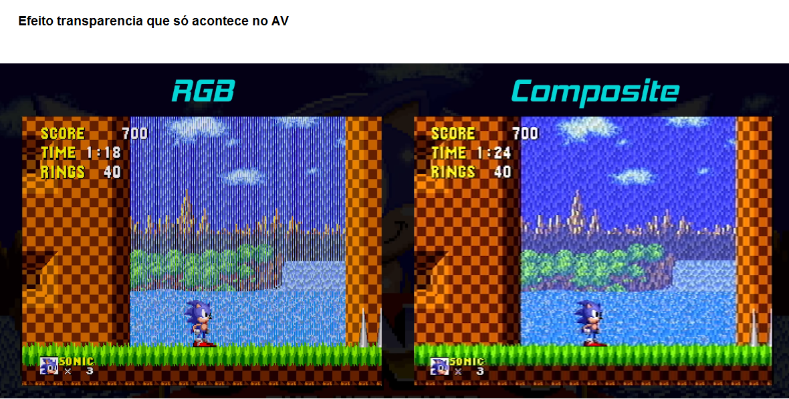

# TV TUBO

Pq tv de tubo:

Efeito de transparência que só acontece no sinal AV

MOD RGB nas TV de tubos

https://www.youtube.com/watch?v=ZBnfvqdeXgY

https://www.youtube.com/watch?v=C6dY6ADRPXc

Manutenção 

https://www.youtube.com/watch?v=2I8Us3SyloY

https://www.youtube.com/watch?v=96orW1Hx_LQ

