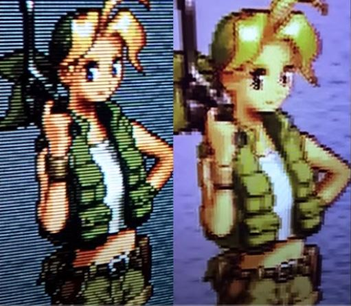

# TV TUBO

Pq tv de tubo?: (Esse jogos foram desenvolvidos pensado em rodar nessas Tvs)(não vale a penas usar tv de tubo na geração HD para frente)

- As scanlines alinham os pixels

- A iluminação da tv mesclam as cores dos pixels

Efeito de transparência que só acontece no sinal AV

MOD RGB nas TV de tubos

https://www.youtube.com/watch?v=ZBnfvqdeXgY

https://www.youtube.com/watch?v=C6dY6ADRPXc

Manutenção 

https://www.youtube.com/watch?v=2I8Us3SyloY

https://www.youtube.com/watch?v=96orW1Hx_LQ

https://www.youtube.com/watch?v=Tj8Lw6BO39k

https://www.youtube.com/watch?v=v9EOidc6NyA

https://www.youtube.com/watch?v=wNDy3n1JsFI

https://www.youtube.com/watch?v=S_v9ya6ARkI

https://www.youtube.com/watch?v=jETwqIAh5A4

https://www.youtube.com/watch?v=6lJVSR9AwUw

CURIOSIDADES

https://www.youtube.com/watch?v=awL6rq1Yzz4
