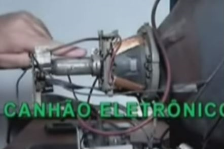
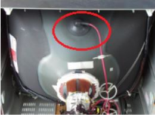
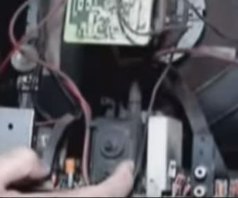

--------------------------------------------

Fontes:
https://www.electronica-pt.com/fontes-alimentacao/fontes-alimentacao-tv

https://www.youtube.com/@cristiano91106/search?query=AULA
-------------------------------------
Sequencia de imagem

1-(trama)Para um televisor funcionar primeiro ele tem que ter trama:
trama é uma tela totalmente acessa tanto no sentido horizontal quanto no vertical

2-(imagem)

3-(COR)

4-(SINCRONISMO)Depois vem o sincronismo. A imagem não pode quebrar nem no sentido horizontal nem no sentido vertical.

5-(SOM) Por último temos o som

se ele tem esses 5 aspectos significa que ele está funcionando perfeitamente

há dois tipos de ajustes: Ajuste do usuários (tecla menu do controle remoto). Ajuste do técnico (no modo de serviço, para acessar esse ajuste existe uma senha que vem no manual de serviço da tv, varia de tv para tv)

OBS: 
  O controle remoto é imprescindível para o conserto da tv.

  O Tubo também chamado de cinescópio.

  A tela é medida na diagonal

# Funcionameto

Tela: Parte da frente
Atrás da tela tem milhares de pontos de fósforo que acende quando é atingido por um feixe de elétrons. O feixe de elétrons é produzido no canhão eletrônico

Para que os elétrons sejam atraídos com força e bater no fósforo eles devem ser atraídos por uma alta tensão. (essa tensão é aplicada na parte de cima do tubo através de uma chupeta de borracha (alta tensão (mat) cerca de 25000 v))

Essa alta tensão é produzida por um transformador especial chamado FlayBack

