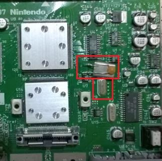
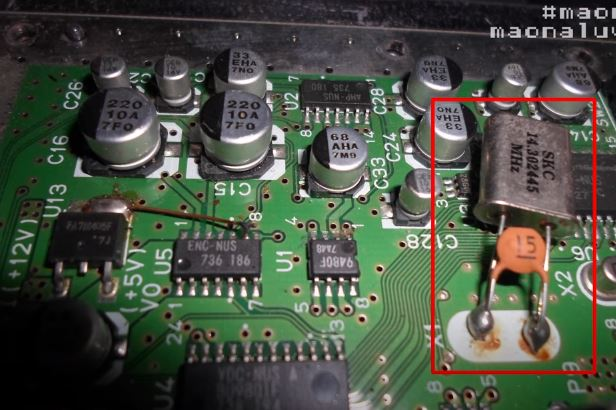
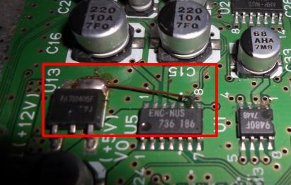

Problema comum:

## Nintendo 64 reinicia ou trava depois de 30 min de uso.

(geralmente se faz recap e em alguns casos é o precessador com defeito)

https://www.retroreversing.com/n64rdp

## Nintendo 64 PAL-M para NTSC (revertendo a gambiarra de época)

O cristal padrão NTSC do nintendo 64: 14.31818Mhz 

Antigamente as vezes colocava o cristal PALM em cima do outro sem retirar o original

Em outros casos eles removem o cristal NTSC original e colocam o PALM

Em alguns casos eles levantavam a perninha do chip gráfico e aterravam

#### Tem outros casos dos aparelhos da gradiente que já eram PALM de fábrica

Fonte:
https://www.youtube.com/watch?v=zUP9YJxSkhI
