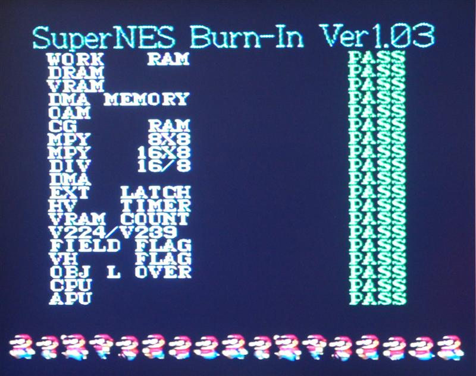
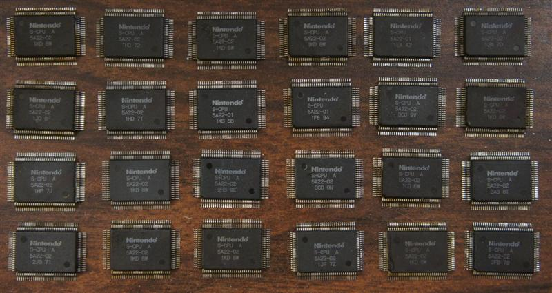
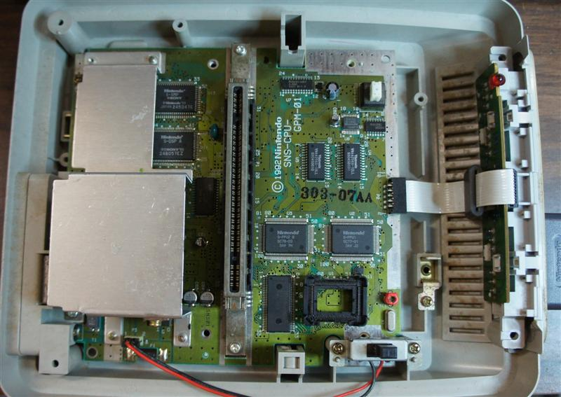
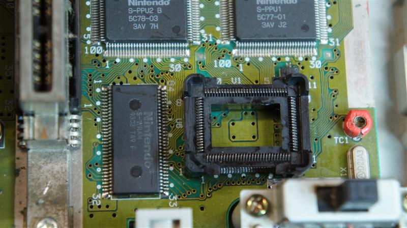
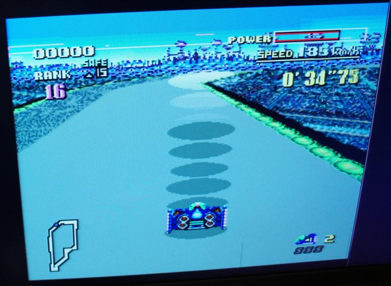
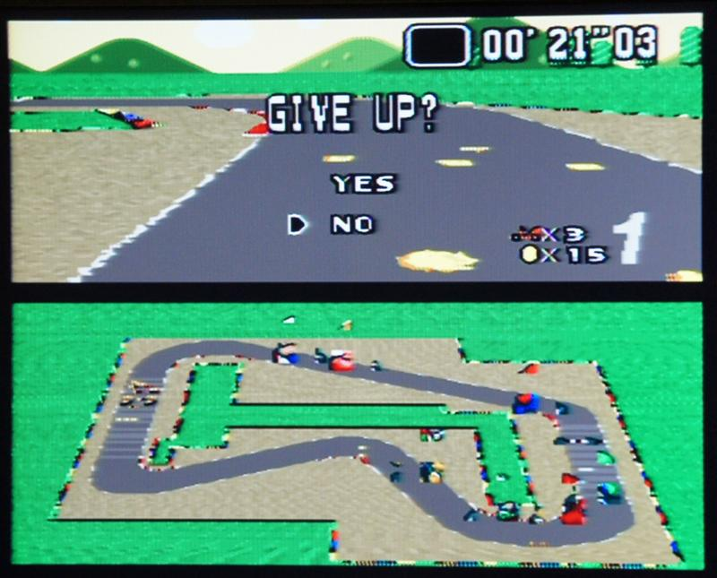
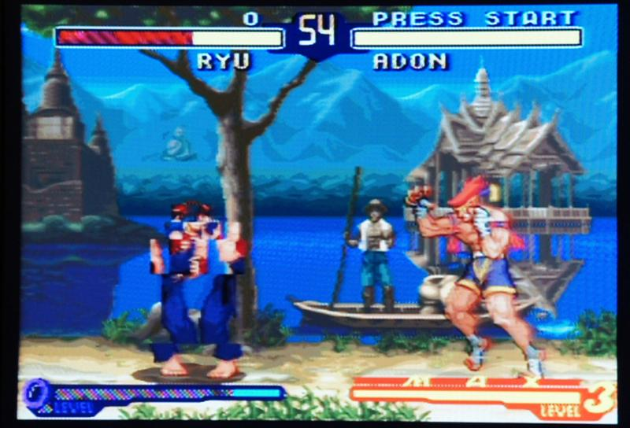

# Nintendo Super System (and SNES) repair/diagnosis logs

## Main Nintendo Super System Page

# Table of contents

- Troubleshooting Tips

- Super System motherboard repair log

- CPU failures

- PPU failures

- "What-if" failures

# Nintendo Super System / SNES troubleshooting tips

- If working on a Nintendo Super System (arcade) motherboard, be sure to use a V3 BIOS (I've seen several faulty boards wouldn't boot to the menu on V1 or V2, even though the menu circuitry was fine)

- Again, on the Nintendo Super System, be sure to check the +5V at the board and adjust. The stability of the system doesn't seem very sensitive to an exact voltage, but there is no voltage regulator (like the SNES), so the entire SNES circuitry will be running directly from the +5V from the power supply. If the voltage is adjusted too high, it's likely to significantly shorten the life of the chips (possibly the cause of some of the failures I came across).

- A bad CPU seems to be the most common failure, and has many different symptoms (see specific failures below)

- My experience is that PPU1, PPU2, and VRAM failures don't affect game logic, just the display of the game (though in some cases will cause certain games not to boot). So, for example if the Mario Kart track looks bad and it thinks you're off the track and Lakitu keeps picking you up, it's likely a CPU problem (or possibly WRAM)... but if the game still plays fine, I'd suspect a PPU problem (though you can have CPU problems that don't affect gameplay).

- Statistics: While working with Super System and SNES motherboards, I came across 24 bad CPUs, 4 bad PPU1s, 4 bad PPU2s, 1 bad APU, and no bad WRAMs or VRAMs... if you suspect either a bad CPU or WRAM, I'd say odds are better that the CPU is bad.

- A bad CPU can cause controller problems. I'd check the obvious first (wiring, controllers, etc. on the Super System, and swap the controller, ports, ribbon on the SNES), though if that all checks out, some controller problems I've encountered from CPUs include dead controls and buttons seemingly connected together (press one button and multiples show as pressed).

- A bad APU can cause the system to not boot (not the most likely cause, but it's easy to swap on boards with the sound module).

- I highly recommend making/borrowing/buying a Burn-In test cart (described <a href="https://tcrf.net/SNES_Burn-In_Test_Cart">HERE</a> ). Even when other games won't boot, many times it'll boot, test the hardware, and tell you which tests failed. It won't necessarily tell you the bad chip, but you can make educated guesses from the results.

# Nintendo Super System motherboard repair log

-1-
Had gray screen issue
Determined the voltage to the video mixing chip was low, due to high resistance of R71
Replaced R71
R101 (for audio circuit) was also out of spec, so replaced that too
---FIXED---

-2-
Some games worked, others had glitchy graphics (SMW looked fine, F-Zero had track issues)
Ran test cart, said bad DMA
Replaced SNES CPU
---FIXED---

-3-
Would boot to menu, but when started, some games would play music with solid color screen, others would do nothing
Ran test cart, said bad HV Timer
Replaced SNES CPU
---FIXED---

-4-
Had previously been worked on, had hacks, etc.
Would boot to menu, but when started, SNES half seemed mostly dead
Ran test cart, would show garbled main screen, when selected any sub-test, it locked up
Replaced SNES CPU Still had garbled graphics, but was able to run test... said bad VRAM, DMA, VRAM COUNT
Looked at rework of PPUs and noticed some pins on PPU1 had no solder. Resoldered PPUs and it booted and everything looked good
There was also no sound.
Looking over the other hacks, someone had removed R101. Replaced with ERJP 1/2W 10 ohm resistor.
---FIXED---

-5-
Played some games fine, but mostly mode 7 games like F-Zero and Mario Kart had problems. F-Zero was really jumpy when turning, and Mario Kart played fine by looking at the map, but the main screen had a scrambled track. Super Mario World also showed a few minor glitches, like the bar of the rotating platform was jumpy.
Ran test cart, said bad MPY 8X8 and DIV 16/8
Replaced SNES CPU
---FIXED---

-6-
Would boot to menu, but when started, SNES half seemed dead
Ran test cart, still dead
Replaced SNES CPU
---FIXED---

-7-
Would boot to menu, but when started, SNES half seemed mostly dead (occasionally booted to garbage graphics)
Ran test cart, would show main screen, but when Burn-In Test selected, would show random Japanese characters in place of graphics
Replaced SNES CPU Passed all tests, but had some graphics problems (some colors wrong, glitchy vertical lines in some graphics, etc)
Replaced SNES PPU2
---FIXED---

-8-
Would boot to menu, but when started, SNES half seemed dead (could hear it reboot occasionally)
Ran test cart, when selected any sub-test, it locked up
Replaced SNES CPU
---FIXED---

-9-
Mostly worked, occasional black screen, some sound issues
Inspected board and noticed poor soldering on modifications
Solder didn't flow on resistor mod
Large glob of solder over both L55 and L56 (shorting both together, not each)
Had loud hum when plugged into the cabinet, though sounded fine on the testbench
Suspected power supply noise was getting through to audio circuitry due to old resistor/jumper wire modification
uninstalled old modification and installed upgraded original resistors
---FIXED---

-10-
Sound not working properly
Inspected board and noticed solder pads configured for Mono audio
Soldered jumpers to original Stereo configuration
Audio worked on testbench, but not when installed in cabinet (cabinet has volume control connected to JAMMA edge, testbench has no control)
Audio is enabled by providing power to one side of potentiometer (JAMMA pin lowercase 'c'). Noticed the board was never powering this pin
Traced pin 'c' to Q15 (NPN Transistor marked "BR", likely BCW60DR), had good voltages in, but never "turned on"
Replaced with same type of transistor from dead SNES motherboard
---FIXED---

-11-
Would boot to menu, but when started, some games would run with graphics issues, others would only show black screen
Ran test cart, said HV Timer failed
Replaced SNES CPU
---FIXED---

-12-
Game plays fine, but when either Y or B are pressed, both were activated
Tested resistance between Y and B inputs, not shorted
Probed lines at IC52 (Parallel to Serial shift register) and CPU and everything looked fine
Replaced SNES CPU
---FIXED---

-13-
Would boot to menu, but when started, SNES half seemed dead
Ran test cart, still dead
Replaced SNES APU
---FIXED---

-14-
Would boot to menu, but when started, SNES half seemed dead
Ran test cart, would boot, but display garbage after selecting test
Replaced SNES CPU Test then showed VRAM HIGH FAIL, DMA FAIL, VRAM COUNT FAIL
Replaced SNES PPU1
---FIXED---

-15-
Would boot, but all the graphics were blocky garbage, though you could tell that the games were playing (scrolling background, track, etc).
Replaced SNES PPU1
---FIXED---
Note: The +5V was adjusted to over 6.5V, which may have contributed to PPU1 failure

-16-
Would boot to menu, but when started, some games would run with weird problems, some would lock up during boot
Ran test cart, passed all tests
Replaced SNES CPU
---FIXED---

-17-
Would boot to menu, but when started, SNES half seemed dead
Ran test cart, still dead (occasionally showed menu and immediately locked up)
Replaced SNES CPU
---FIXED---

-18-
Would boot to menu, but when started, SNES half seemed dead
Ran test cart, still dead
Replaced SNES CPU
---FIXED---

# Misc CPU failures

Because of the large number of bad CPUs I encountered, I installed a QFP socket in a Super Famicom system to quickly test suspect CPUs and pulls from unknown motherboards.

1) Won't boot most games, test cart boots, but shows Japanese characters at burn-in test
2) Won't boot most games, test cart hangs at boot
3) Won't boot most games, test cart boots, but locks up after selecting any test
4) Won't boot most games, test cart boots, but locks up after selecting any test (and timer never increases)
5) Dead
6) Won't boot most games, test cart boots, but shows garbage at burn-in test
7) Dead
8) Dead
9) Dead
10) Dead
11) Dead
12) Dead
13) Plays most games fine, all tests pass, won't boot some games (SFA2, Yoshi's Island, etc)
14) Some games boot to garbage or audio only, test cart boots, HV Timer failed
15) Won't boot most games, test cart hangs at boot
16) Won't boot most games, test cart passes all tests
17) Some games boot to garbage or audio only, test cart boots, HV Timer failed
18) Everything works except dead controls
19) Everything works except lots of buttons appear shorted together (press one and lots of buttons are "pressed")
20) Everything works except Y and B appear shorted together (press one and both buttons are "pressed")
21) Some games work correctly, others have weird glitches (like floating shadows in F-Zero), test cart says DMA failed

22) Most games work correctly, some have weird sprite glitches (SFA2 bad flipped sprites, SMK karts on bottom map), some hang during boot (Yoshi's Island), test cart passes all tests

23) Lots of games play fine (like SMW, though the rotating bar is jumpy), but some act really weird (especially the track on Mode 7 games, and the ship on Star Fox is all over the place), test cart says MPY 8x8 and DIV 16/8 failed

Fonte: https://www.projectvb.com/nss/logs.htm#whatif
