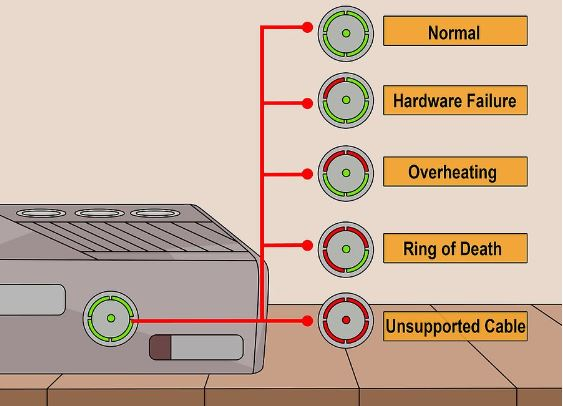
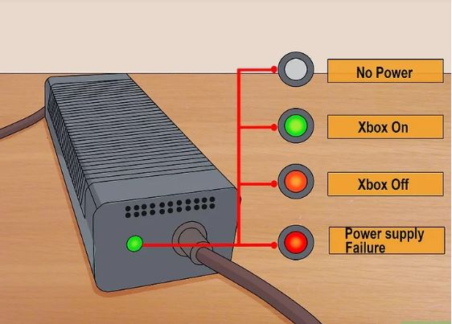

## 00 - Código de Luzes

- Luzes verdes - o sistema está funcionando corretamente.

- Uma luz vermelha - indica um erro geral de hardware, e geralmente vem acompanhado de um código na televisão (por exemplo "E74").

- Duas luzes vermelha - indicam um superaquecimento no console. Desligue-o por algumas horas e garanta uma ventilação adequada nas laterais.

- Três luzes vermelhas - esse é o "anel vermelho da morte" e indica uma falha grave de hardware. O erro geralmente ocorre devido à deformação da placa-mãe causada por um superaquecimento, fazendo com que os chips percam o contato. Nesse caso, você vai precisar abrir o console e consertá-lo ou enviá-lo para uma assistência técnica.

- Quatro luzes vermelhas - indica um cabo de áudio/vídeo danificado ou não suportado.

- Nenhuma luz - a fonte de energia não está recebendo energia da tomada.

- Luz verde - a fonte de energia está funcionando corretamente e o Xbox está ligado.

- Luz laranja - a fonte de energia está funcionando corretamente e o Xbox está desligado.

- Luz vermelha - a fonte de energia está apresentando alguma falha. A causa mais comum de nesse caso é um superaquecimento dela. Desplugue ambas a extremidades da fonte de energia e deixe-a esfriar por pelo menos uma hora.
