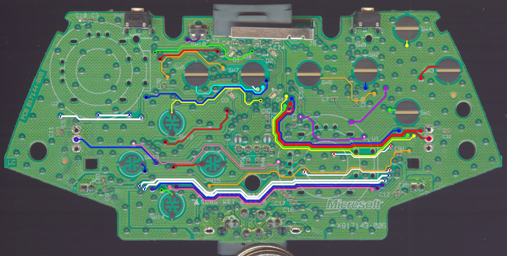
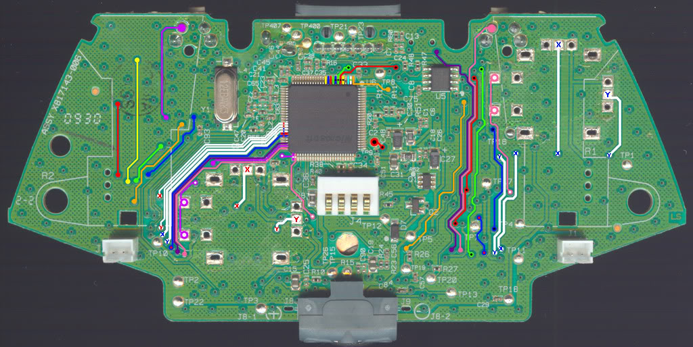
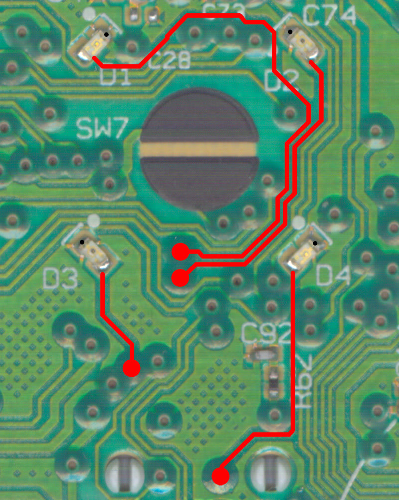

### TOP

### BOTTOM 

TP1 - N/A

TP2 - Ground

TP3 - B+

TP4 - Ground

TP5 - B+

TP7 - Ground

TP8 - Analog Voltage, 1.5v (Switched)

TP9 - DR

TP10 - Light Rumble

TP11 - Heavy Rumble

TP12 -

TP13 -

TP15 -

TP16 - N/A

TP17 - Ground

TP18 -

TP19 -

TP20 -

TP21 - USB D- (PnC Cable)

TP22 - Ground

TP23 - USB D+ (PnC Cable)

TP26 -

TP400 - Ground

TP405 - Antenna

TP407 - Ground

### LED

