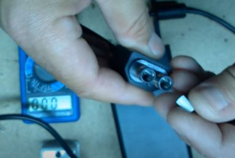
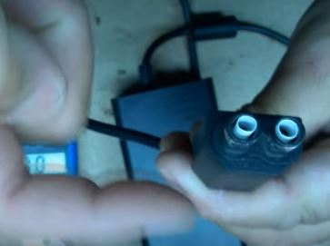
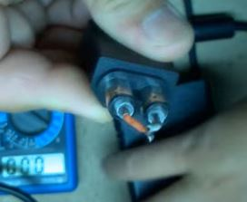
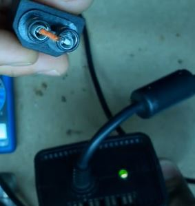
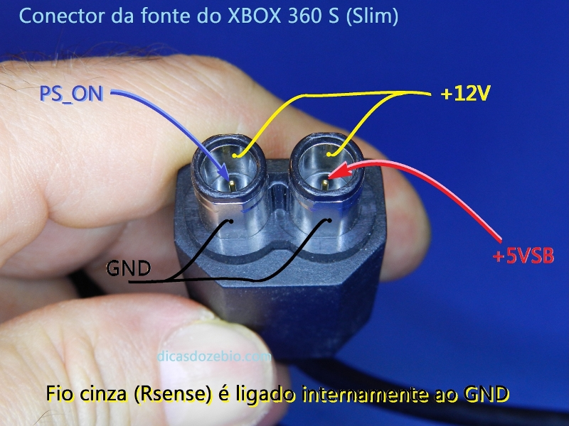
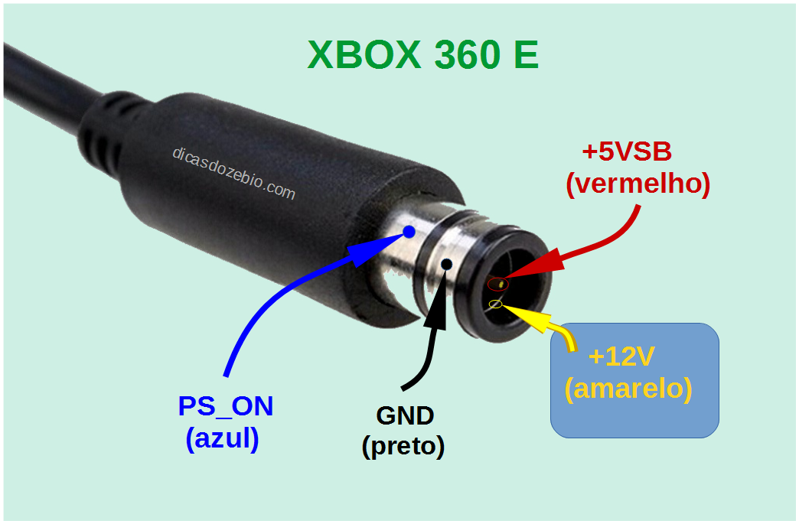

# Fonte do xbox 360

obs: A fonte é chamada de PSU (Power supply unit) nos esquemas elétricos

## Problema 1: Quando se liga a fonte de 110 no 220.

  Pode queimar:
    
    - fusível
    
    - estourar os capacitores grandes
    
    - abrir os varistores.(mais raro)

OBS: A fonte do xbox one não funciona no xbox 360 slim

## Teste Fonte XBOX 360 slim:

1 - você isola a fonte com pendaço de canudo

2 - Você coloca jumper lingando a fonte

Tensões Fonte Slim

Tensões Fonte Super Slim

