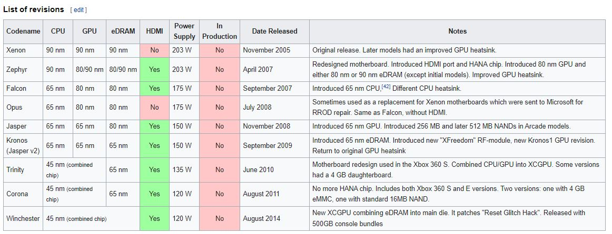
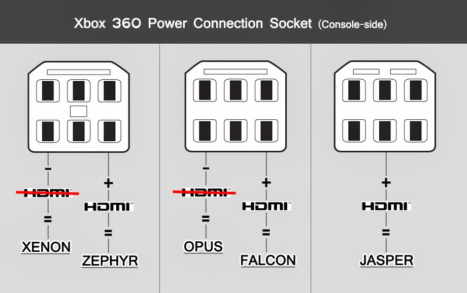
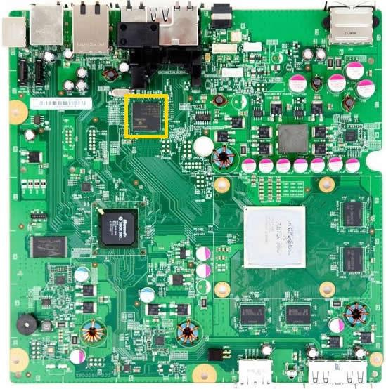
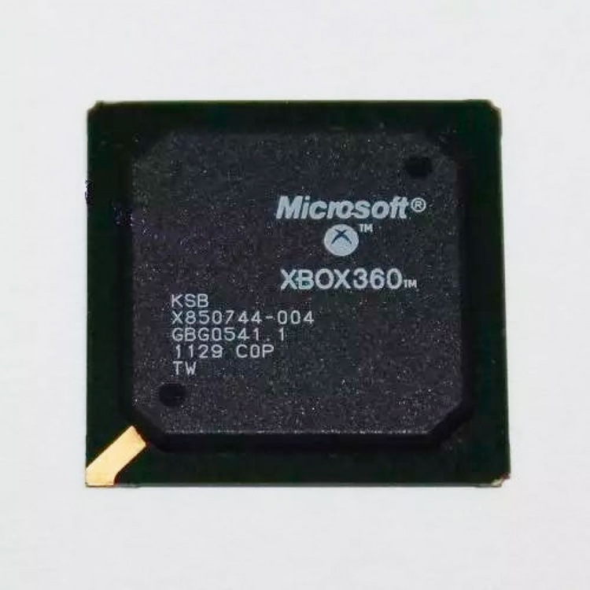
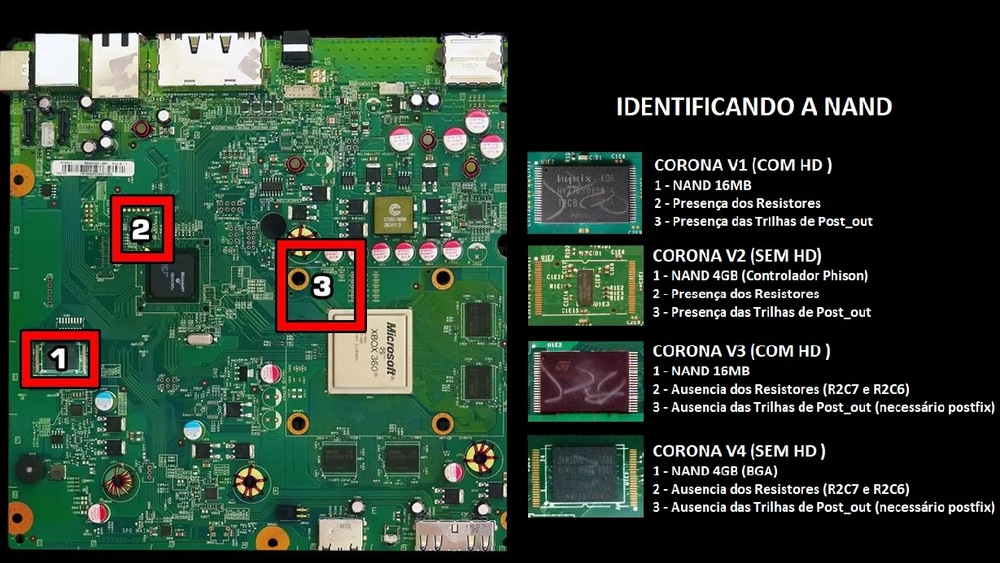
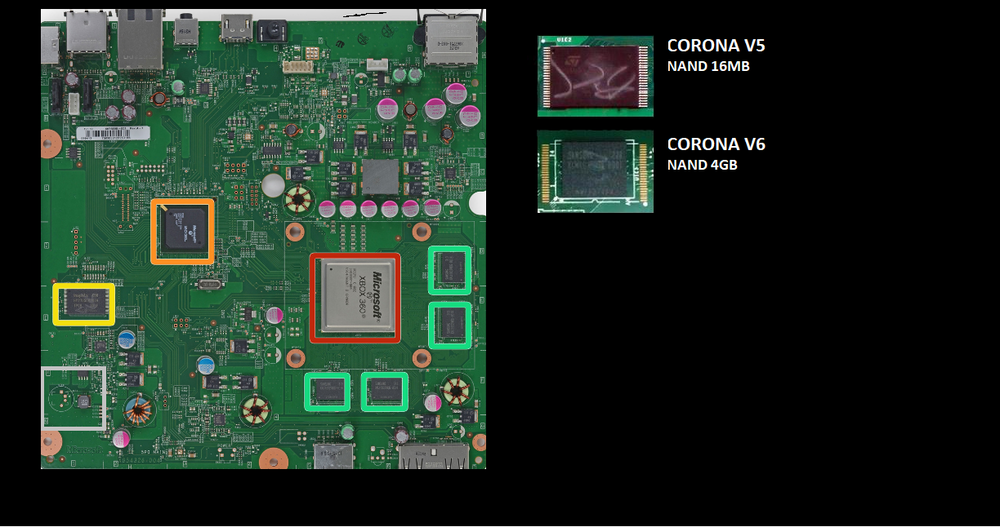
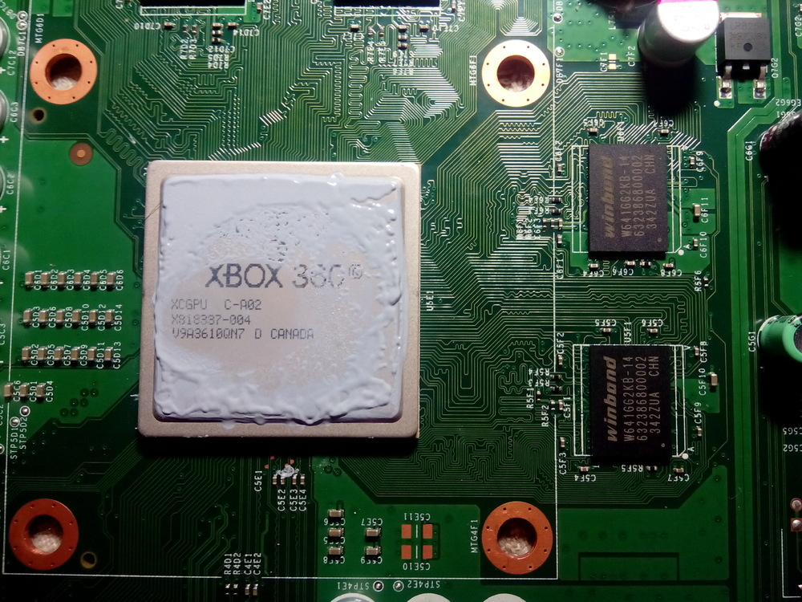
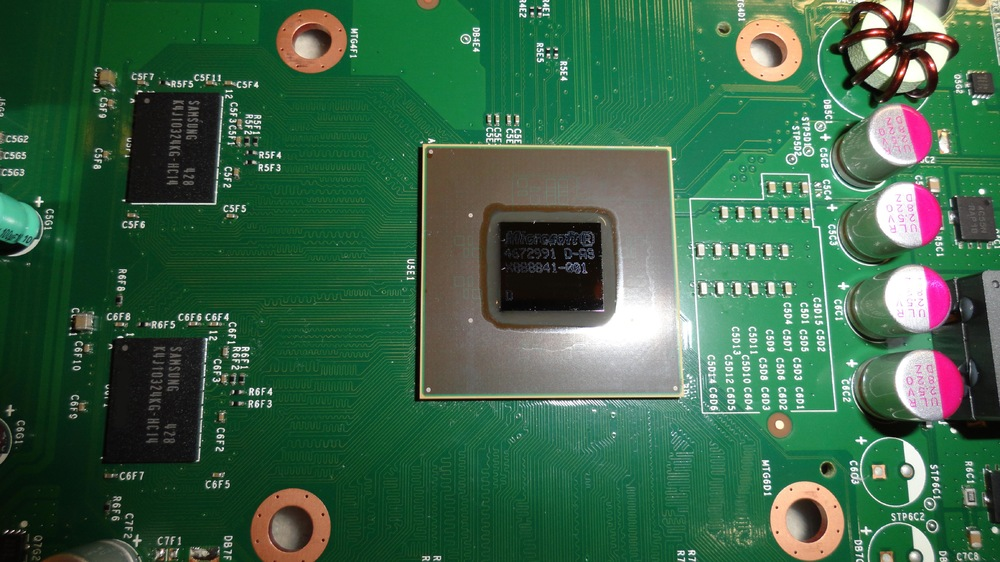
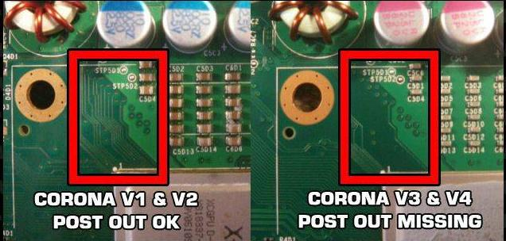
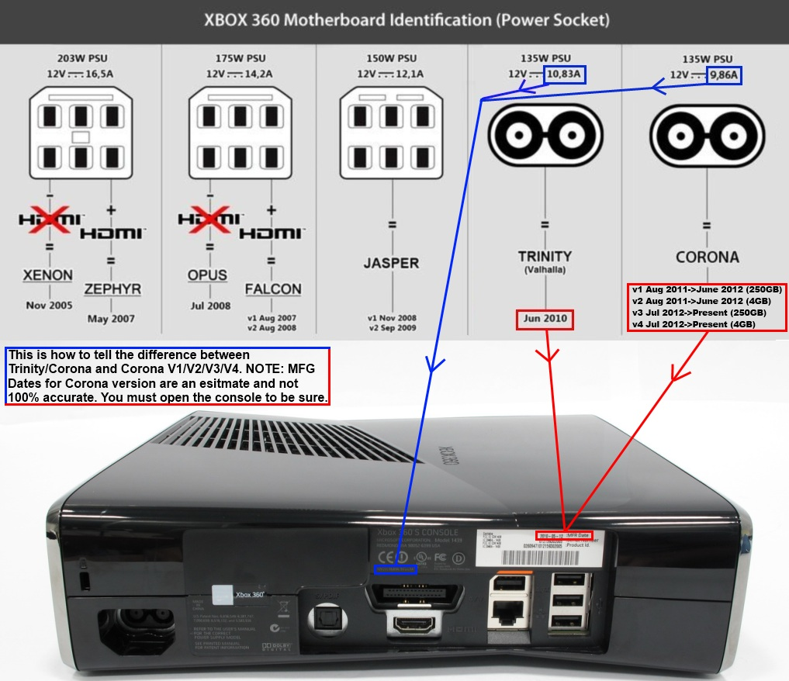

# XBOX 360

Diferenças Modelos XBOX 360 

Revisão das Placas:



## FAT

Para Xbox Fat é só olhar o conector da fonte.



### Jasper

foi a placa mais icônica do modelo Fat

```
Problemas mais comuns:

Por conta do processo de fabricação da placa

```
2:20

## SLIM

### Trinity

Fabricado entre 2009 a Setembro de 2011

As placas Trinity são as mais fáceis de identificar. Elas tem alguns componentes herdados do anterior modelo JASPER.

Então basta verificar se existe o chip bga HANA conforme figura abaixo.




### Corona

Fabricado entre Outubro de 2011 a 2015

Nessa versão de placa a MS juntou as funções do Hana e PSB transformando em 1 unico BGA que chamamos de KSB.




Atualmente existe 8 versões de placa corona e a diferença comum é o tamanho da NAND que podemos classificar da seguinte forma.

 - Com **NAND 16MB** , geralmente acompanha HD de expansão.

Modelos CORONAS V1, V3 , V5, V7

 - Com **NAND 4GB**, não acompanha HD

CORONAS V2, V4, V6, V8

Segue abaixo uma tabela para facil identificação



```
ADIÇÃO PARA CORONA V5:

A CORONA V1 E V5 SÃO IDÊNTICAS, A LEITURA DA NAND É USADA COM NAND-X, E NECESSITA DE POSTFIX ALÉM DE FECHAR AS TRILHAS DOS RESISTORES R2C7 E R2C6 E NÃO PRECISA ATERRAR O CRISTAL. 

Para um boot rápido, recomendo o uso de fio curto e fino no ponto c de preferência de 1 único filamento, já o ponto D pode ser o tamanho necessário para chegar ao chip. 
```

Ja nos Modelos Corona V5 e V6 podemos notar diferenças maiores em relação aos anteriores 



O principal e mais importante no RGH é identificação do tipo de Nand e  se tem memórias Winbond 2k ao redor da CGPU.

Se tiver, devemos usar um xell patched para conseguir ter sucesso no boot.



**Corona v7 e v8**

Alem da diferença entre as nands, a principal nesses modelos é da alteração da CGPU. Até o momento não é possível RGH, LTU etc ... 



OBS: Corona (pra verificar a necessidade do post fix)



## SUPER SLIM

### Winchester


Algumas diferenças pelo conectores e pela label:



Fontes:

https://eletronicabr.com/forums/topic/143817-identificando-placas-xbox-360/

XBOX 360 Defeitos Mais Frequentes JASPER, TRINITY, CORONA, WINCHESTER modelos Fat e Slim - https://www.youtube.com/watch?v=yH_VKOJiILM
